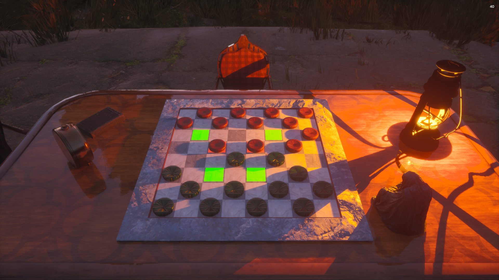

# LEV PROROK

### Junior QA Engineer

**Manual Testing · Game QA · IT Support**

 

---

> **I like figuring out why things break — and making sure they don't break again.**

---

## ✦ ABOUT

I'm an IT specialist with a background in Information Systems and Programming and a year of hands-on experience in system administration.

Before moving towards QA, I worked with the practical side of IT: supporting users, setting up workstations, troubleshooting hardware and software, working with Windows and Astra Linux, and dealing with local networks.

That experience naturally pulled me towards testing.

I like the investigative part of IT — reproducing a problem, checking different scenarios, looking for edge cases and trying to understand what is actually happening rather than just fixing the visible symptom.

Now I'm building my QA portfolio through practical projects and moving from system administration into software testing.

---

## ✦ WHAT I BRING

<table>
<tr>
<td width="50%">

### 🧪 QA

- Manual Testing
- Functional Testing
- Exploratory Testing
- Regression Testing
- Test Cases
- Checklists
- Bug Reports
- Game Logic Testing

</td>
<td width="50%">

### 💻 IT & TROUBLESHOOTING

- Windows
- Astra Linux
- TCP/IP
- DNS / DHCP
- VPN
- Local Networks
- Software Configuration
- Hardware Diagnostics
- PC Assembly & Repair
- Technical Support

</td>
</tr>
</table>

---

# 🎮 FEATURED PROJECT

## Checkers 3D

**Unreal Engine 5 · Windows · Local Multiplayer**

### The idea

A small 3D checkers game designed for **two players on the same PC**.

I used the project as a practical QA case rather than simply treating it as a finished game. The goal was to explore the game logic, reproduce different gameplay scenarios and document the issues found during testing.

### What I tested

| Area | Checked |
|---|:---:|
| Piece selection | ✓ |
| Piece movement | ✓ |
| Capturing | ✓ |
| Multiple captures | ✓ |
| Turn switching | ✓ |
| Mandatory capture | ✓ |
| Capture paths | ✓ |
| Game ending | ⚠ |
| King promotion | ⚠ |

### 🐛 Bugs found

**BUG-001 — Mandatory capture can be skipped**

When a capture is available, the player can choose a regular move instead.

**BUG-002 — No control over the subsequent capture path**

When multiple continuation paths are available, the player can choose the initial direction, but the remaining sequence is performed automatically.

### QA Documentation

[ **PROJECT OVERVIEW** ](QA/Checkers3D/README.md)

[ **TEST CASES** ](QA/Checkers3D/TEST-CASES.md)

[ **BUG REPORTS** ](QA/Checkers3D/BUG-REPORTS.md)

---

## ✦ EXPERIENCE

### System Administrator

**Jun 2025 — Jun 2026**

**Government Organization**

One year of practical experience supporting users and maintaining IT infrastructure.

- User technical support and troubleshooting
- Workstation setup and maintenance
- Operating system and software installation
- Windows and Astra Linux administration
- Local network configuration
- TCP/IP, DNS, DHCP and VPN
- Hardware and software diagnostics
- PC assembly, repair and upgrades
- Printer, scanner, monitor and peripheral configuration
- Antivirus installation and maintenance

---

## ✦ EDUCATION

### Specialist in Information Systems

**Voronezh Institute of High Technologies**

`2021 — 2025`

---

## ✦ CURRENTLY LEARNING

I'm gradually expanding my QA toolkit and building a stronger foundation in software testing.

**Currently exploring:**

`SQL` · `Postman` · `DevTools` · `Git`

**Long-term interests:**

`Test Automation` · `Information Security`

---

## ✦ LANGUAGES

🇷🇺 **Russian** — Native

🇬🇧 **English** — B1

---

## ✦ HOW I APPROACH PROBLEMS

My background in system administration taught me to look at problems from the inside.

Instead of stopping at *"it doesn't work"*, I try to:

**reproduce → isolate → investigate → document → understand**

I'm bringing the same approach into software testing.

---

### Looking for a Junior QA / QA Intern opportunity

**Let's build something that doesn't break.**

 

📧 **vizher.game@gmail.com**

